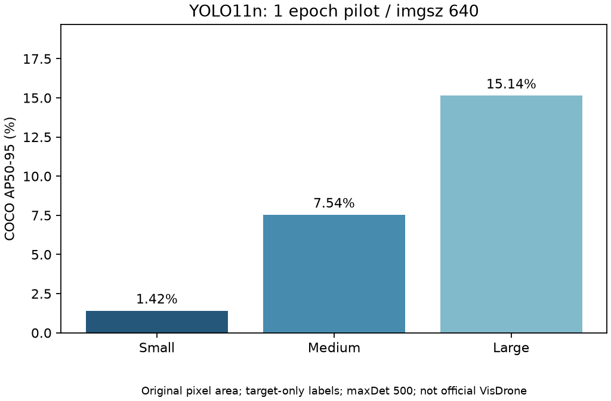

# exp-002 — YOLO11n full-split 1-epoch pilot

**Status: completed / pilot. 본학습 완료 또는 공식 VisDrone 점수가 아닙니다.**

## Hypothesis and implementation

전체 VisDrone train/val에서 640-pixel YOLO11n의 초기 기준과 small-object miss 양상을 측정하고, 후속 본학습의 학습·평가·재현 경로를 확인합니다. 한 epoch로 수렴이나 모델의 최종 성능을 주장하지 않습니다.

- Dataset: VisDrone2019-DET train 6,471장 / val 548장, [준비 snapshot](../../docs/datasets/visdrone2019-det-2026-10-08/README.md), 변환 v2, 0면적 annotation 3행 제외·원본 보존
- Model: COCO-pretrained YOLO11n, Ultralytics 8.4.174 / torch 2.14.1 / torchvision 0.29.1
- Config: [yolo-pilot.toml](../../configs/yolo-pilot.toml), seed 42, imgsz 640, batch 8, SGD, lr0 0.01, mosaic 1.0, 1 epoch
- Environment: Python 3.11.9 / macOS 14.7.8 / Apple M1 16 GiB / MPS FP32 / numpy 2.4.6 / pycocotools 2.0.11
- Actual execution: 2026-10-09 00:23:48–00:51:53 Asia/Seoul (학습뿐 아니라 준비·validation·prediction·COCO·timing 전체)
- Code provenance: base commit `1d5e2c33202156b12b2ec607b085b0154639ea69`, dirty working tree에서 실행. 정확한 실행 source/config/dataset/weights hash는 [summary.json](summary.json)에 기록했고 runner/helper는 export 시 현재 파일과 일치합니다. base commit만으로 새 실행 코드를 복원할 수 없으므로 source hash와 이 변경을 포함한 commit을 함께 사용해야 합니다.

실제 실행 명령(저장소 root):

```bash
.venv-yolo/bin/python -B scripts/run_yolo_experiment.py --config configs/yolo-pilot.toml
.venv-yolo/bin/python -B scripts/summarize_yolo_run.py --run outputs/exp-002-yolo11n-pilot-mps --figure
```

`outputs/exp-002-yolo11n-pilot-mps/`에 원본 JSON metric·GT/prediction·environment·config·provenance·console.log·best/last checkpoint와 framework args/results.csv를 보존합니다. 출력 directory가 존재하면 덮어쓰지 않으므로 재실행은 새 experiment ID를 사용합니다. 공개 요약은 whitelist를 통해 만들었으며 데이터·weights·절대 로컬 경로는 Git에 넣지 않았습니다.

## Measured results

[CSV](../../results/tables/exp-002-yolo11n-pilot-mps.csv)는 AP를 0..1 fraction으로 저장합니다. 아래 표는 백분율로 표시합니다. AP는 target-only COCO bbox protocol, 원본 image 면적, IoU 0.50:0.05:0.95, 101 recall points, maxDet 500 기준입니다. confidence ≥ 0.001·class-aware NMS IoU 0.7 prediction을 사용합니다. ignore 영역 suppress는 적용하지 않습니다.

| Metric | Measured value | Definition |
| --- | ---: | --- |
| COCO mAP50 | 8.55% | 모든 면적, IoU 0.50 |
| COCO mAP50-95 | 4.58% | 모든 면적, 10 IoU thresholds |
| AP_small | 1.42% | 원본 면적 0..1,024 px² |
| AP_medium | 7.54% | COCO medium area range |
| AP_large | 15.14% | COCO large area range |
| Precision | 54.21% | conf ≥ 0.25, 같은 class IoU ≥ 0.50, global TP/FP |
| Recall | 21.40% | 동일 고정 operating point, global TP/FN |
| FPS | 36.27 | cached BGR array, FP32, batch 1, 20장 sample |
| Mean latency | 27.57 ms/image | 전처리·추론·NMS·result 포함, disk/decode 제외 |
| p50 / p95 latency | 12.56 / 36.52 ms/image | warm-up 3회, MPS 호출 전후 동기화 |



참고로 **별도 Ultralytics validation**은 mean P 27.35%, mean R 16.27%, mAP50 10.13%, mAP50-95 4.95%였습니다. P/R는 smoothed mean-F1-selected confidence의 class 평균입니다. 별도 COCO pass는 evaluator의 matching/interpolation과 batch-1 prediction 경로를 사용하며 위 표와 직접 동일시하지 않습니다. 각 차이가 점수에 미친 영향은 별도 대조하지 않았습니다. 상세 원본은 `ultralytics-validation.json`에 있습니다. 이후 비교에서는 주 evaluator를 동일하게 고정해야 합니다.

Timing 20장 중 한 장은 304.48 ms였습니다. outlier를 제거하지 않았으며 평균과 p50이 크게 다릅니다. 작은 sample·이미지별 모양·MPS 실행 환경의 영향이 있어 이 FPS를 전체 dataset 처리속도나 실시간 배포 성능으로 일반화하지 않습니다. 원인을 profiling으로 확정하지 않았습니다.

## Failure analysis

고정 confidence 0.25 / matching IoU 0.50에서 TP 8,293, FP 7,006, FN 30,466입니다. small GT 26,588개 중 23,992개를 놓쳤습니다(small Recall 9.76%). **이 초기 실행에서는 small-object recall이 낮았다는 관찰**이며, 낮은 점수의 원인을 입력 해상도 하나로 단정하지 않습니다.

| Val file / image ID | Targets | TP | FP | FN | Small FN |
| --- | ---: | ---: | ---: | ---: | ---: |
| `0000295_02400_d_0000033.jpg` / 375 | 317 | 41 | 63 | 276 | 257 |
| `0000295_02000_d_0000031.jpg` / 373 | 311 | 43 | 31 | 268 | 244 |
| `0000295_01800_d_0000030.jpg` / 372 | 306 | 37 | 26 | 269 | 253 |

위 세 장에서 로컬 GT(cyan)/prediction(red) overlay를 직접 확인했습니다. 같은 교차로의 유사한 장면이며, 가까운 일부 큰 차량에는 bbox가 겹치지만 먼 차량·작은 보행자 주변에는 GT만 보이는 경우가 많았습니다. 그림의 색은 TP/FP 판정이 아니라 GT/prediction 구분이며, class와 IoU matching 통계는 별도로 계산했습니다. 세 유사 장면을 독립적인 세 failure 유형으로 세지 않습니다. raw overlay는 이용 조건 미확정으로 GitHub에 공개하지 않고 `outputs/<id>/failure-review/`에만 보존합니다. 가림·밀집도별 정량화와 원인 attribution은 후속 작업입니다.

## Validation and conclusion

- 실제 trainer가 train 6,471 / val 548장 모두 읽었습니다. train 동일 label 4개를 framework가 제거하여 학습 target은 343,200개이고 val 38,759개는 유지했습니다. 준비본 파일은 변경하지 않았습니다. cache audit counts/hash를 summary에 보존했습니다.
- 학습 후 전체 원본·변환 hash/inventory와 381,963개 target 좌표 audit를 다시 실행하여 passed를 확인했습니다(`metadata/audit-after-yolo-v1.json`).
- 모델 환경 합성 regression 77개, 별도 no-site metadata 17개 통과. MPS 전체 train/val 및 실제 CPU 한 장 inference를 확인했습니다.
- CUDA·CPU 학습, 본학습 수렴, 공식 VisDrone evaluator·ignore loss masking, scene leakage와 장시간 timing benchmark는 미검증입니다.
- 기본 warm-up 3 epochs 중 첫 epoch이며 일부 MPS 연산은 deterministic 구현이 없습니다. seed만으로 bitwise 재현을 보장하지 않습니다. 공식 train 내부 중복과 release별 license 미확정은 데이터 준비 기록의 한계를 유지합니다.

**결론:** 실제 학습·평가·기록 pipeline이 동작하고 초기 small-object miss가 확인됐습니다. 먼저 [50-epoch 본학습 설정](../../configs/yolo-baseline.toml)을 적절한 장치에서 실행하고 수렴·동일 evaluator 기준을 확인한 뒤, RT-DETR 및 해상도 비교로 넘어갑니다. 이 1-epoch 결과로 개선 효과나 YOLO의 최종 성능을 주장하지 않습니다.
